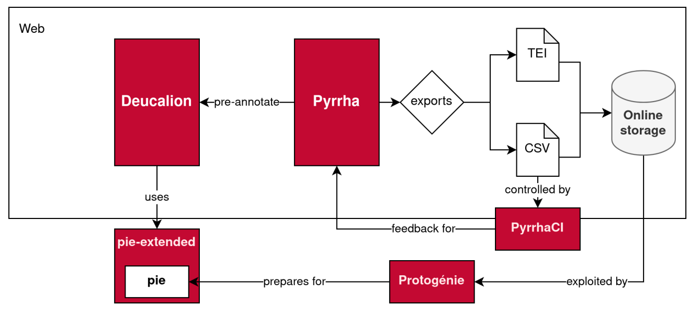

<style>
img[alt~="center"] {
  display: block;
  margin: 0 auto;
}
h1 {
  font-size: 46px;
  color: darkred;
}
h2 {
  font-size: 38px;
  color: darkred;
}
</style>

Distant Reading 2: linguistique computationnelle

# Préparer les données 

Simon Gabay

<a rel="license" href="http://creativecommons.org/licenses/by/4.0/"></a>


---

# Annotation I: lemmatiser

---
## Définition

> La lemmatisation désigne un **traitement lexical** apporté à un texte en vue de son analyse. Ce traitement consiste à appliquer aux **occurrences des lexèmes** sujets à flexion (en français, verbes, substantifs, adjectifs) **un codage** renvoyant à leur entrée lexicale commune (« **forme canonique** » enregistrée dans les dictionnaires de la langue, le plus couramment), que l'on désigne sous le terme de lemme.

Un exemple:

| Texte | Les | étoiles | luisent | dans | la | nuit | noire | . |
| ------|-----|---------|---------|------|----|------|-------|---|
| Lemme | Le  | étoile  | luire   | dans | le | nuit | noir  | . |

---
## Service en ligne

Il existe des services en ligne: https://dh.chartes.psl.eu/deucalion/freem

Vous pouvez faire un essai avec le texte suivant:

```
LA Cigale ayant chanté
Tout l’Eſté,
Se trouva fort dépourvuë
Quand la biſe fut venuë.
```

Evidemment le résultat n'est pas magique. Il faut d'abord entraîner un modèle.

---
## Cycle de travail



Thibault Clérice, Vincent Jolivet, Julien Pilla. "Building infrastructure for annotating medieval, classical and pre-orthographic languages: the Pyrrha ecosystem." _Digital Humanities 2022 (DH2022)_, Jul 2022, Tokyo, Japan. [⟨hal-03606756⟩](https://shs.hal.science/hal-03606756v1).


---
## Lemmatiser: le (pré-)problème de la tokénisation

* _pomme_
* _pomme de terre_
* _aujourd'hui_
* _c'est_
* _tire-bouchon_
* _veux-tu_
* _Celui-ci_
* _treshumble_ (XVIIe s.)
* _C'est M. Dupont._
* _bien que_
* _parce que_
* _ce pendant_ (XVIe s.)

---

## Lemmatiser: cas limites

Il y a un problème avec les homographes (impossibles à traiter avec une approche par lexique):

> _Il **est** à l'**est** de la ville._

> _Je **suis** légaliste: je **suis** la loi._

L'homographie peut être accidentelle (OCR, anciens états de langue):

> _Il va **a** Paris._

Il peut aussi y avoir un problème avec le polymorphisme:

>_Il y a **besoing** et **besoin**._

---
## Lemmatiser: cas problématiques

* _comtesse_
* _va-t-il_
* _Jehan_
* _Jeanne_
* _Vespasianus_ 
* _François de La Rochefoucauld_
* _Oeuf_
* _Égypte_
* _aux_
* _dudit_

---
## Lemmatiser: cas problématiques

* _comtesse_ -> Féminin? ou masculin?
* _va-t-il_ -> Que faire du _-t-_ euphonique?
* _Jehan_ -> normaliser les noms?
* _Jeanne_ -> Féminiser les noms propres?
* _Vespasianus_ -> Moderniser les noms?
* _François de La Rochefoucauld_ -> _le_ ou _La_?
* _Oeuf_ -> comment traiter les ligatures?
* _Égypte_ -> garder les accents sur les majuscules?
* _aux_ -> lemme composé _à_le_? _à+le_?
* _dudit_ -> lemme composé "triple" _de_le_dit_?

---
## Lemmatiser: quelques cas

* _Il me demande à moi_
* _Un retour éclatant_
* _Une âme affligée_
* _Les .X. comandemenz_ (XVe s.)
* _le pater noster_
* _s'enfuir_
* _Le Père R._
*  _il ne leur manquera rien_ vs _leur vif éclat_
* _qui n'en veut?_ (corpus oral)
* _Y z'y vont_
---
## Lemmatiser: quelques cas

* _Il me demande à moi_ -> moi=_je_ ou _moi_?
* _Un retour éclatant_ -> adj ou participe présent?
* _Une âme affligée_ -> adj ou participe passé?
* _Les .X. commandements_ -> que faire des chiffres?
* _le pater noster_ -> comment lemmatiser les emprunts?
* _s'enfuir_ -> que faire des pronominaux (_abaisser_ vs _s'abaisser_?)
* _Le Père R._ -> Que faire des noms abrégés?
*  _il ne leur manquera rien_ -> pronom _il_ vs déterminant possessif _leur_
* _qui n'en veut?_ -> particule clitique de fausse liaison
* _Y z'y vont_ -> transformation euphonique _ils_>_y_ sur le modèle de la liaison+ particule enclitique formant un pronom(?)

---
# Annotation II: parties du discours

---
## Parties du discours: quelques cas

* _la Fortune_
* _un retour éclatant_
* _mon Dieu_ vs _le dieu Jupiter_
* _parce que_
* _vive les vacances_
* _voici_
* _18 ans_ vs _ses 18 ans_
* _le pater noster_
* _le Père R._

---
## Parties du discours: quelques cas

* _la Fortune_ -> `NOMpro` ou `NOMcom`
* _un retour éclatant_ -> `VERppa`
* _mon Dieu_ (détermination non pertinente -> `NOMpro`) vs _le dieu Jupiter_ (`NOMcom`)
* _parce que_ -> `ADVgen` par analogie (_bien que_)
* _vive les vacances_ -> `VERcjg`
* _voici_ -> `VERcjg`
* _18 ans_ `DETcar NOMcom` vs _ses 18 ans_ `DETpos ADJcar NOMcom`
* _le pater noster_ -> `ETR`
* _le Père R._ -> `ABR`

---
## Parties du discours: quelques cas

* _aux_
* _duquel_
* _Monsieur de La Rochefoucauld_
* _Mesnil montant_ (Ménilmontant)
* _là-dessus_
* _premier_
* _dernier_

---
## Parties du discours: quelques cas

* _aux_ -> `PRE.DETdef`
* _duquel_ -> `PRE.DETrel` ou `PRE.PROrel` ou `PRE.PROint` en fonction du contexte
* _Monsieur de La Rochefoucauld_ -> `NOMcom PRE NOMpro NOMpro`
* _Mesnil montant_ (Ménilmontant) `NOMpro VERppa`
* _là-dessus_ -> `ADVgen PONfbl ADVgen`
* _premier_ -> `ADJord`
* _dernier_ -> `ADJqua`

---

# Annotation III: morphologie

---
## Morphologie: quelques cas

* _je_
* _me_
* _moi_
* _mes_
* _vous êtes odieux_
* _il est clair_
* _J’ai mangé_
* _rien_
* _Julien Sorel_

---
## Morphologie: quelques cas

* _je_ -> `CAS=n` nominatif
* _me_ -> `CAS=r` régime direct
* _moi_-> `CAS=i` régime indirect
* _mes_ -> `PERS.=1|NOMB.=s` ou `PERS.=1|NOMB.=p`
* _vous êtes odieux_ -> Féminin ou masculin? _vous_ `GENRE=x`
* _il est clair_ -> Masculin ou neutre? `NOMB.=s|GENRE=n` ou `NOMB.=s|GENRE=m`?
* _J’ai mangé_ -> `VERcjg MODE=ind|TEMPS=pst` + `VERppe`
* _rien_ -> `MORPH=empty`
* _Julien Sorel_

---
## Annoter

Avec ces premières idées, on va pouvoir commencer à anoter. Il existe une interface pour accélérer la transcription (contrôle qualité, corrections en lot…): https://dh.chartes.psl.eu/pyrrha/

---
## Sources

* Thibault Clérice, Matthias Gille Levenson, Lucence Ing, Ariane Pinche, Simon Gabay, Jean-Baptiste Camps, «Lemmatiser des textes et corriger l'annotation grâce à l'apprentissage profond avec Pyrrha », _Humanistica 2021_, Mai 2021, Rennes, France. [⟨hal-03224112⟩](https://hal.archives-ouvertes.fr/hal-03224112).

* Simon Gabay, Jean-Baptiste Camps, Thibault Clérice. "Manuel d'annotation linguistique pour le français moderne (XVIe -XVIIIe siècles) : Version B." 2022. [⟨hal-02571190v2⟩](https://hal.science/hal-02571190).