

Distant Reading 2: linguistique computationnelle

# Entraîner un modèle (de lemmatisation)

Simon Gabay

---
# Logique d'entraînement

---
## L'apprentissage automatique

L'apprentissage machine (ou automatique) se fonde sur des approches mathématiques et statistiques pour donner aux ordinateurs la capacité d'« apprendre » à partir de données, c'est-à-dire d'améliorer leur performance à résoudre des tâches sans être explicitement programmés pour chacune.

Il existe plusieurs méthodes:
* Machines à vecteurs de support
* Méthodes statistiques
* Les réseaux de neurones
* …

---
## Vers l'apprentissage profond

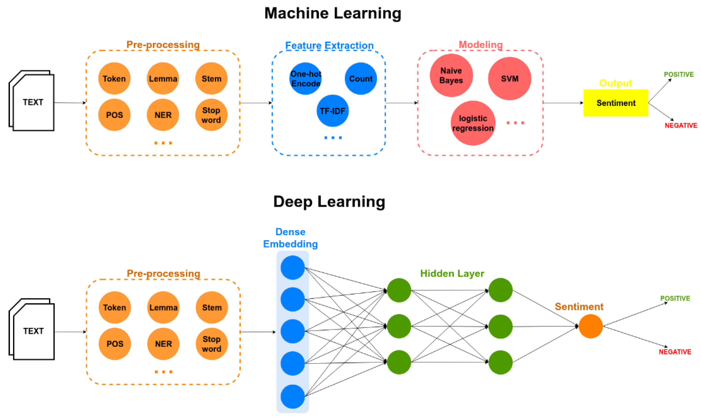

---
## Apprendre pour une machine

Pour apprendre à une machine à faire quelque chose, on a deux possibilités:
1. Donner des règles à la machine: _suivons_ a pour lemme _suivre_. Le problème c'est qu'il existe des cas ambigus: _suis_? Il faut alors rajouter des règles toujours complexes
2. Donner des exemples à la machine, qui va déduire des règles à partir des exemples: _je suis un homme_ -> _être_ vs _je suis le cours_ -> _suivre_. Le problème c'est qu'il faut beaucoup d'exemple

Nous allons ici suivre la seconde méthode, qui est plus efficace. Il va donc nous falloir des exemples

---
## Entraînement d'un modèle

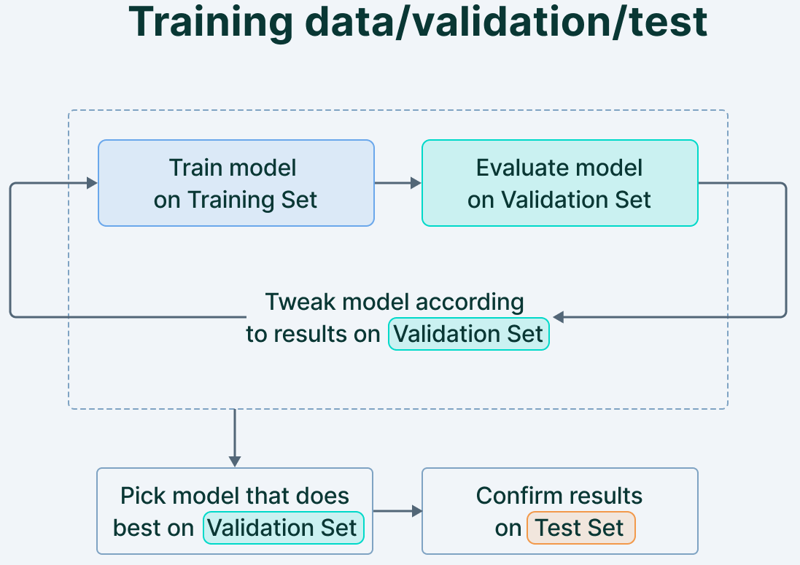

---
## Faire le _split_

La répartition des données dans les trois jeux dépend de la quantité de données à disposition

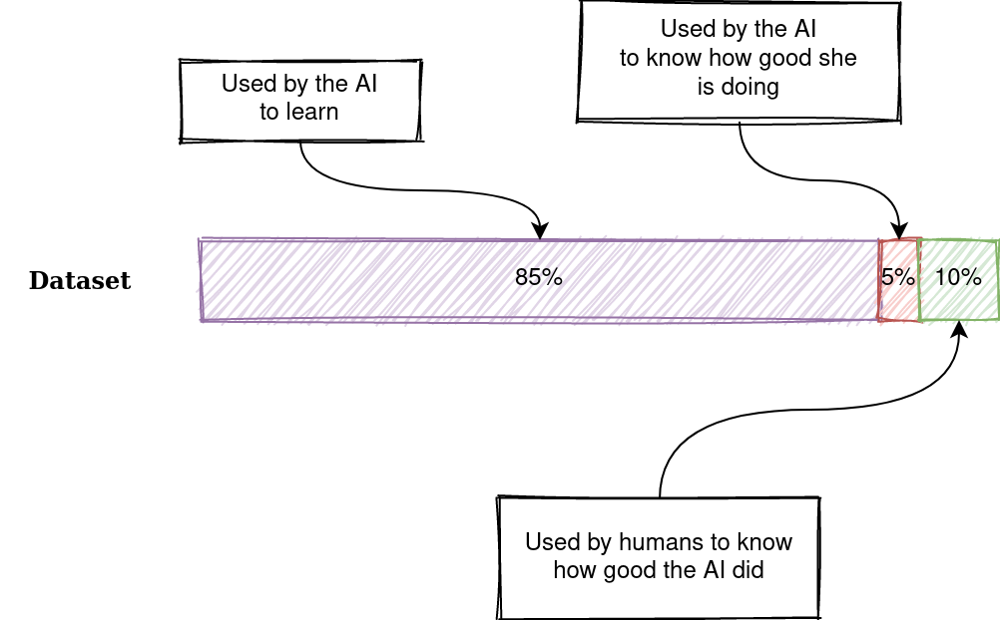

Il existe un outil pour faire ce split de manière propre: https://github.com/hipster-philology/protogenie

---
## Tests
Le score du test n'a pas de valeur en soi, il dépend:
* Des données d'entraînement
* Des données dans le jeu de test

99% sur un texte ne vaut pas (forcément) 99% sur un autre texte.

Pour le test, on peut utiliser des données:
* _In domain_: elles sont proches du jeu d'entraînement (tirées du même livre par exemple)
* _Out of domain_: elles sont différentes du jeu d'entraînement -- la question étant de savoir jusqu'à quel point différentes

---
## Evaluer le résultat
* La précision (_precision_) est le ratio du nombre de vrais positifs par rapport au nombre total de prédictions positives. Le nombre de fois où il a bien reconnu _être_ par rapport au nombre de fois où il a cru le reconnaître.
* Le rappel (_recall_) est le ratio du nombre de vrais positifs par rapport au nombre total d’objets réels (pertinents). Le nombre de fois où il aurait dû reconnaitre _être_ par rapport au nombre de fois qu'il l'a reconnu.
* l'exactitude (_accuracy_) est le nombre de prédictions correctes (vrais positifs+vrais négatifs) par rapport au nombre total de prédictions. Le nombre de fois où il ne s'est pas trompé en reconnaissant, ou en ne reconnaissant pas être.

---

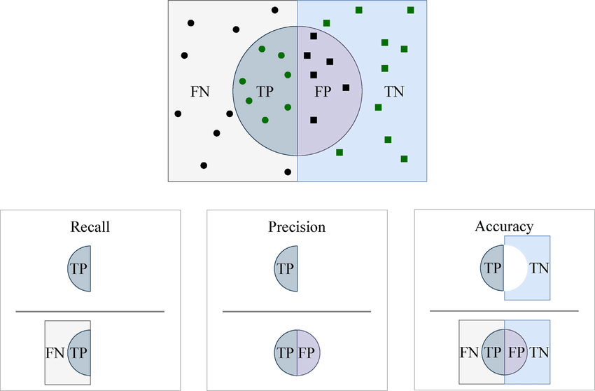

---
## Cycle d'amélioration d'un modèle

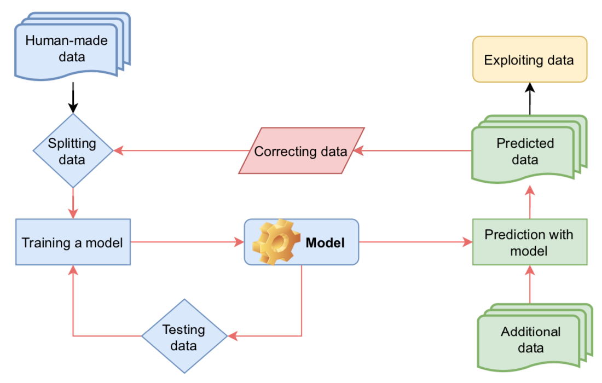

---
# Déroulé de l'entraînement

---
## Un peu de vocabulaire
* Une époque (_epoch_) correspond au passage de l'entièreté du jeu de _train_ à travers le réseau de neurones
* La taille de lot (_batch size_) est le nombre d'exemples du jeu de _train_ montré à la machine avant la mise à jour du modèle.
* L'itération (_iteration_) correspond au nombre de _batches_ pour compléter une époque.

Si j'ai 1000 exemples, en faisant des lots de 250 il me faudra 4 itérations avant de compléter 1 époque.

La taille de _batch_ a un impact direct sur les performances du modèles.

---
## Elle descend de la montagne à cheval

Le processus d'apprentissage correspond à la descente d'un marcheur vers le point le plus bas de la vallée:
1. Je le localise le point le plus bas
2. J'avance un bout de chemin
3. Je m'arrête pour réajuster mon chemin
4. Et ainsi de suite jusqu'à ce que j'arrive en bas

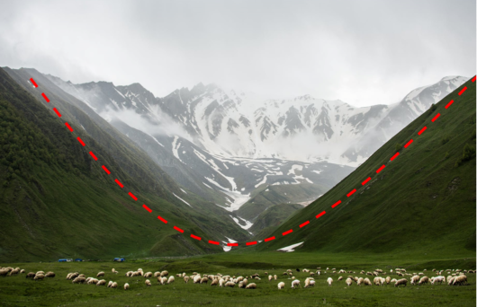

---
## Fonction de coût

En montagne: notre objectif est d'arrivée à distance de zéro entre l'endroit où je me trouve et l'endroit oùe je veux aller.

En ML: la fonction de perte (ou de coût, _loss function_) est la quantification de l’écart entre les prédictions du modèle et les observations annotées. L'objectif est d'atteindre zéro.

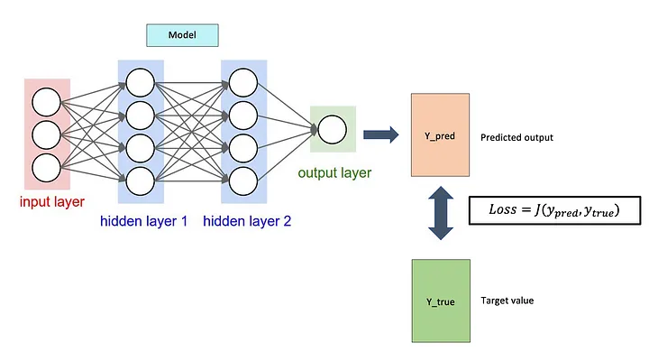

---
## Descente de gradient

En montagne: on est perdu et on mesure la valeur de la pente pour redescendre pour atteindre le point le plus bas de la vallée.

En ML: la descente de Gradient (_gradient descent_) est un algorithme qui permet de trouver le minimum de n’importe quelle fonction convexe (comme celle de coût) en convergeant progressivement vers celui-ci.

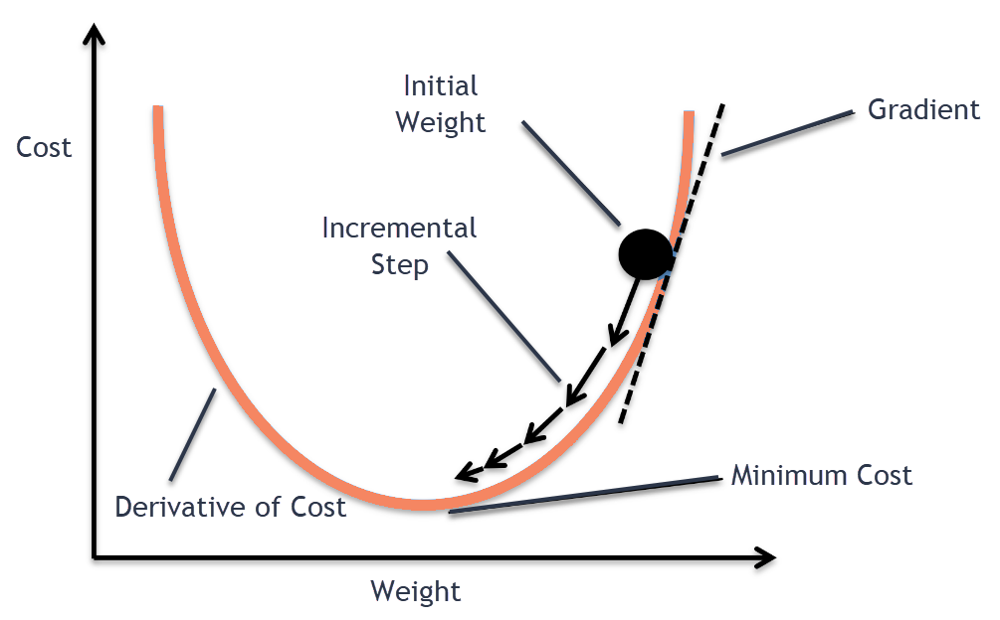

---
## Taux d'apprentissage

En montagne: on doit descendre progressivement vers le bas de la vallée. Quelle est la distance à parcourir à chaque étape pour ne pas dépasser le point le plus bas de la vallée, mais y aller le plus vite possible?

En ML: le taux d'apprentissage (_learning rate_) est un hyperparamètre qui joue sur la rapidité de la descente de gradient, soit la rapiditié/amplitude avec laquelle la valeur des paramètres de notre modèle est ajustée.

---
## Rétropropagation

En montagne: je me suis trompé de chemin, je corrige ma trajectoire.

En ML: la rétropropagation (_backpropagation_) du gradient consiste à mettre à jour les poids de chaque neurone de la dernière couche vers la première, afin de corriger les erreurs de prédiction.

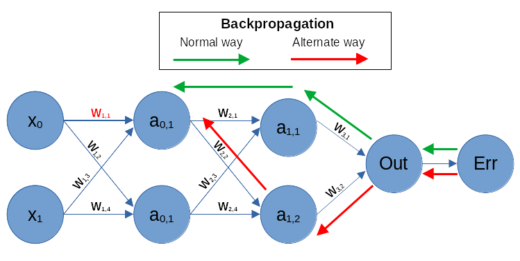

---
## Optimiseur

En montagne: plutôt que de parcourir la même distance à chaque étape de ma descente, je vais ajuster la distance à chaque étape en fonction de ma situation.

En ML: on n'utilise plus des taux d'apprentissage fixe, mais adaptif pour la descente stochastique de gradient.
* La descente est dite "stochastique", car elle calcule le gradient en fonction d'un échantillon et non de la totalité des données. 
* L'optimiseur est dit "adaptatif" car il est recalculé en tenant compte, par exemple, des précédents changements.

Le plus utilisé des optimiseurs est "Adam" ([Kingma 2014](https://arxiv.org/abs/1412.6980)).

---
## La patience

En montagne: cela fait plusieurs étapes que je n'arrive pas à descendre significativement, je vais donc diminuer la longueur de mes étapes pour arriver à trouver le bon chemin. Je tâtonne.

En ML: après un nombre _n_ d'époques sans amélioration, je diminue le taux d'apprentissage.

---
## Sur- et sous-apprentissage

* La généralisation désigne la capacité d'un modèle à effectuer de bonnes prédictions sur des données qu'il n'a pas vu pendant la procédure d'entraînement.
* Le surapprentissage apparaît quand le résultat correspond trop préciséement à un ensemble de données et n'est pas généralisable à des observations supplémentaires et/ou futures.
* Le sous-apprentissage est le phénomène inverse: le modèle n'arrive même pas à produire de bonnes prédictions avec les données d'entraînement

---
# Approche par séquence

---
## Génération de séquence

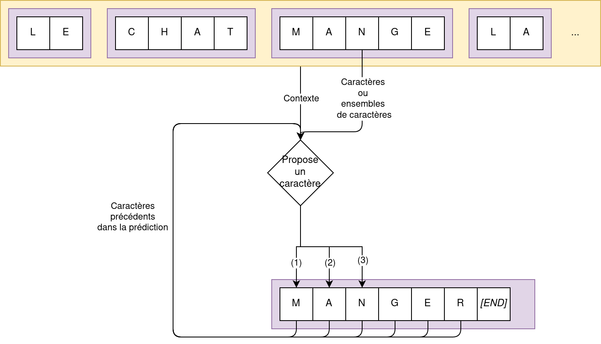

---
## Architecture encodeur-décodeur

Un Encodeur-Décodeur est un modèle de _deep Learning_ composé de deux réseaux de neurones, qui fonctionne de manière inversée:
* Le premier réseau (encodeur) prend en entrée du texte (caractère, mot…) et produit une séquence de chiffres
* Le second réseau (décodeur) reprend cette séquence chiffrée et la transforme en texte.

L'intérêt de cette architecture est que la taille de l'entrée n'est pas nécessairement la même que pour la sortie (_est_->_être_ / _je suis étudiant_->_I am a student_)

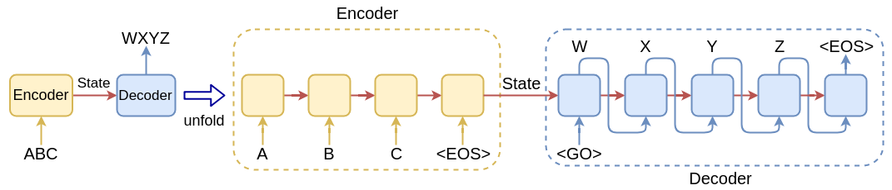

---
## Modèle séquence à séquence (dit _seq2seq_)

Le cœur de l'architeture _seq2seq_ ([Sutskever 2014](https://dl.acm.org/doi/10.5555/2969033.2969173)) est "l'état caché" (_hidden state_).
* L’encodeur traite chaque élément de la séquence d’entrée, compile les informations qu’il capture dans un vecteur (appelé le vecteur de contexte ou d’état caché) qui contient toutes les informations décrivant la séquence.
* L'encodeur envoie ensuite le vecteur de contexte au décodeur, qui commence à produire la séquence de sortie élément par élément.

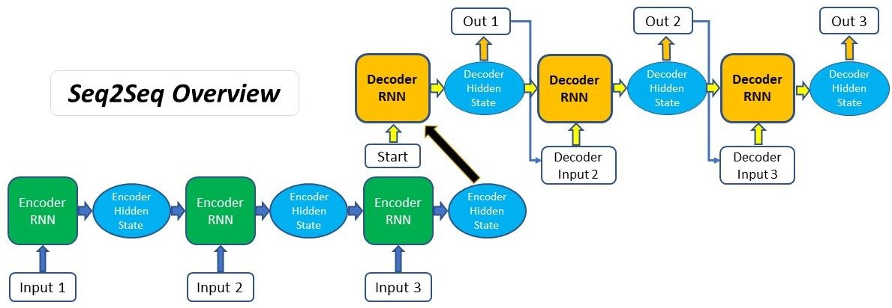

---
## Attention

Si la séquence d'entrée est trop longue, le vecteur se met à contenir trop d'information dont il ne sait que faire. [Bahdanau 2014](https://arxiv.org/abs/1409.0473) propose la méthode suivante:
* Ce n'est plus le dernier état caché qui est transmis au décodeur, mais tous les états cachés (il y a beaucoup plus d'information)
* On attribue un _scoring_ à chaque état caché pour produire un vecteur de contexte, qui met en valeur les éléments les plus importants

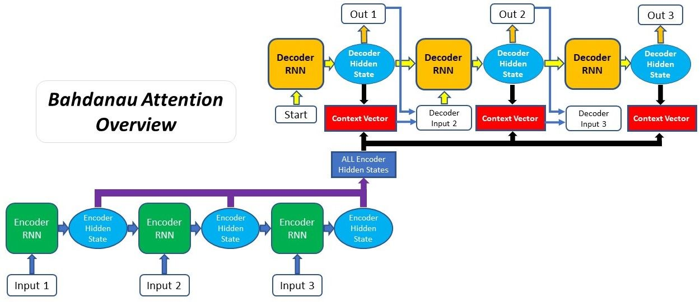

---
## Le vecteur de contexte

Dans le cas de la traduction automatique, le modèle est capable de réaligner les deux séquences, mais aussi de rapprocher _la_ de _area_ (utile pour choisir le genre vers le français).

[comment]: <> (https://lbourdois.github.io/blog/nlp/Seq2seq-et-attention/)