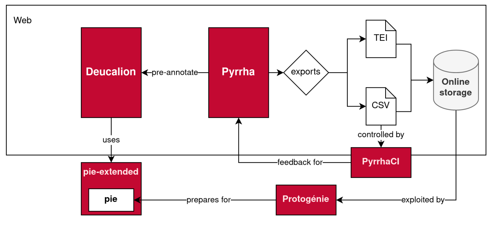
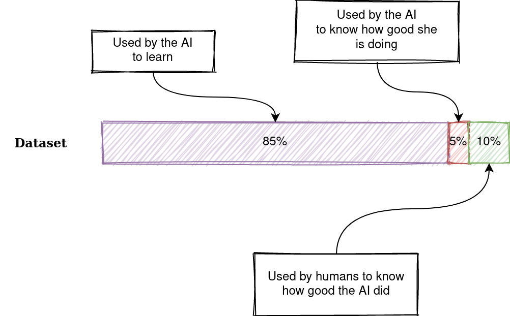
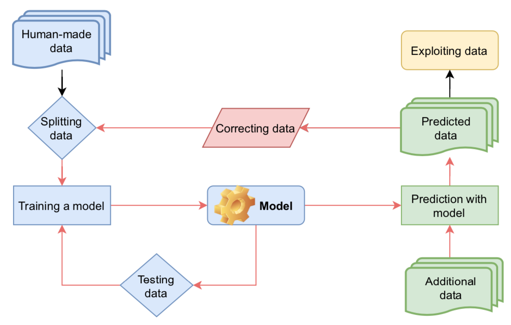
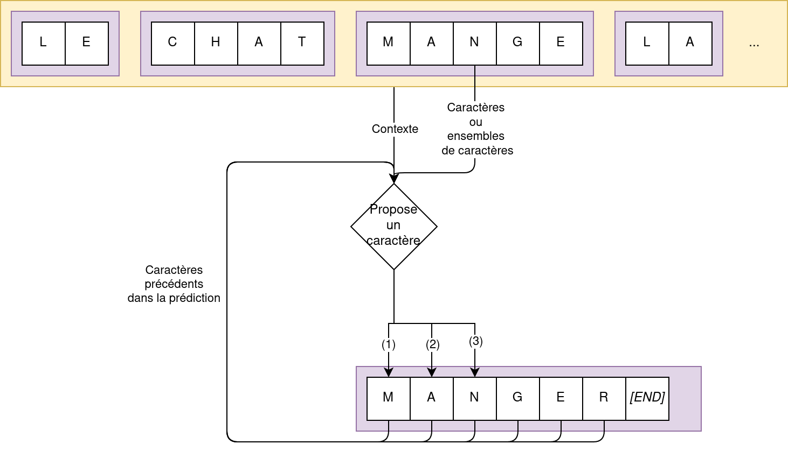

Cours Stylistique numérique

# Une étape clef: lemmatiser

Simon Gabay

---

# Lemmatiser

---
## Définition

> La lemmatisation désigne un **traitement lexical** apporté à un texte en vue de son analyse. Ce traitement consiste à appliquer aux **occurrences des lexèmes** sujets à flexion (en français, verbes, substantifs, adjectifs) **un codage** renvoyant à leur entrée lexicale commune (« **forme canonique** » enregistrée dans les dictionnaires de la langue, le plus couramment), que l'on désigne sous le terme de lemme.

---
## Fonctionnement global

---
## Lemmatiser

| Texte | Les | étoiles | luisent | dans | la | nuit | noire | . |
| ------|-----|---------|---------|------|----|------|-------|---|
| Texte | Les | étoiles | luisent | dans | la | nuit | noire | . |

2 formes sur 8 (25\%) ne peuvent être lemmatisées que d'une seule manière, quelque soit le contexte (en français moderne): la ponctuation (`.`) et la préposition `dans`).

---
## Lemmatiser: quelques cas

* _comtesse_
* _Quelques-uns_
* _Celui-ci_
* _Lui-même_
* _va-t-il_
* _Jehan_
* _Jeanne_
* _Vespasianus_ 
* _bien que_
* _parce que_
* _afin que_
* _François de La Rochefoucauld_

---
## Lemmatiser: quelques cas

* _comtesse_ -> Féminin? ou masculin?
* _Quelques-uns_
* _Celui-ci_
* _Lui-même_ 
* _va-t-il_ -> Que faire du _-t-_ euphonique?
* _Jehan_ -> normaliser les noms
* _Jeanne_ -> Féminiser les noms propres
* _Vespasianus_ -> Moderniser les noms?
* _bien que_ ->
* _parce que_ -> comment analyser _parce_?
* _afin que_ -> comment analyser _afin_?
* _François de La Rochefoucauld_ -> _le_ ou _La_

---
## Lemmatiser: quelques cas

* _Il me demande à moi_
* _Un retour éclatant_
* _Une âme affligée_
* _Les .X. commandements_
* _le pater noster_
* _Oeuf_
* _Égypte_
* _s'enfuir_
* _Le Père R._
* _aux_
* _dudit_
*  _il ne leur manquera rien_ vs _leur vif éclat_
---
## Lemmatiser: quelques cas

* _Il me demande à moi_ -> moi=_je_ ou _moi_
* _Un retour éclatant_ -> adj ou participe présent?
* _Une âme affligée_ -> adj ou participe passé?
* _Les .X. commandements_ -> que faire des chiffres?
* _le pater noster_ -> comment lemmatiser les emprunts?
* _Oeuf_ -> comment traiter les ligatures?
* _Égypte_ -> garder les accents sur les majuscules?
* _s'enfuir_ -> que faire des pronominaux (_abaisser_ vs _s'abaisser_?)
* _Le Père R._ -> Que faire des noms abrégés?
* _aux_ -> lemme composé _à_le_
* _dudit_ -> lemme composé "triple" _de_ledit_?
*  _il ne leur manquera rien_ -> pronom _il_ vs déterminant possessif _leur_

---
## Préparer les données

---
## Cycle d'apprentissage

---
## Fonctionnement du lemmatiseur (classe)

---
## Fonctionnement du lemmatiseur (génération de séquence)

---

# Parties du discours

---

---
## Parties du discours: quelques cas

* _la Fortune_
* _un retour éclatant_
* _mon Dieu_ vs _le dieu Jupiter_
* _parce que_
* _vive les vacances_
* _voici_
* _18 ans_ vs _ses 18 ans_
* _le pater noster_
* _le Père R._

---
## Parties du discours: quelques cas

* _la Fortune_ -> `NOMpro` ou `NOMcom`
* _un retour éclatant_
* _mon Dieu_ (détermination non pertinente -> `NOMpro`) vs _le dieu Jupiter_ (`NOMcom`)
* _parce que_ -> `ADVgen` par analogie (_bien que_)
* _vive les vacances_ -> `VERcjg`
* _voici_ -> `VERcjg`
* _18 ans_ `DETcar NOMcom` vs _ses 18 ans_ `DETpos ADJcar NOMcom`
* _le pater noster_ -> `ETR`
* _le Père R._ -> `ABR`

---
## Parties du discours: quelques cas

* _aux_
* _duquel_
* _Monsieur de La Rochefoucauld_
* _Mesnil montant_ (Ménilmontant)
* _là-dessus_
* _premier_
* _dernier_

---
## Parties du discours: quelques cas

* _aux_ -> `PRE.DETdef`
* _duquel_ -> `PRE.DETrel` ou `PRE.PROrel` ou `PRE.PROint` en fonction du contexte
* _Monsieur de La Rochefoucauld_ -> `NOMcom PRE NOMpro NOMpro`
* _Mesnil montant_ (Ménilmontant) `NOMpro VERppa`
* _là-dessus_ -> `ADVgen PONfbl ADVgen`
* _premier_ -> `ADJord`
* _dernier_ -> `ADJqua`

---

# Morphologie

---
## Morphologie: quelques cas

* _je_
* _me_
* _moi_
* _mes_
* _vous êtes odieux_
* _il est clair_
* _J’ai mangé_
* _rien_
* _Julien Sorel_

---
## Morphologie: quelques cas

* _je_ -> `CAS=n` nominatif
* _me_ -> `CAS=r` régime direct
* _moi_-> `CAS=i` régime indirect
* _mes_ -> `PERS.=1|NOMB.=s` ou `PERS.=1|NOMB.=p`
* _vous êtes odieux_ -> Féminin ou masculin? _vous_ `GENRE=x`
* _il est clair_ -> Masculin ou neutre? `NOMB.=s|GENRE=n` ou `NOMB.=s|GENRE=m`?
* _J’ai mangé_ -> `VERcjg MODE=ind|TEMPS=pst` + `VERppe`
* _rien_ -> `MORPH=empty`
* _Julien Sorel_

---
## Sources

Thibault Clérice, Matthias Gille Levenson, Lucence Ing, Ariane Pinche, Simon Gabay, Jean-Baptiste Camps, «Lemmatiser des textes et corriger l'annotation grâce à l'apprentissage profond avec Pyrrha », _Humanistica 2021_, Mai 2021, Rennes, France. [⟨hal-03224112⟩](https://hal.archives-ouvertes.fr/hal-03224112).