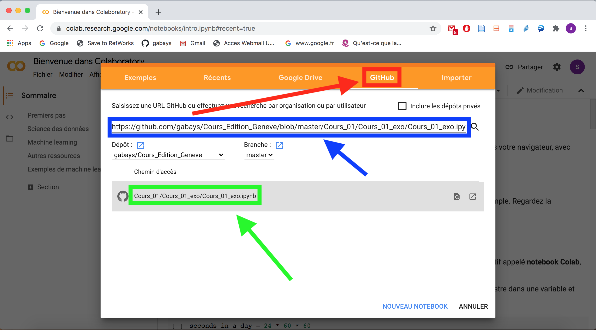
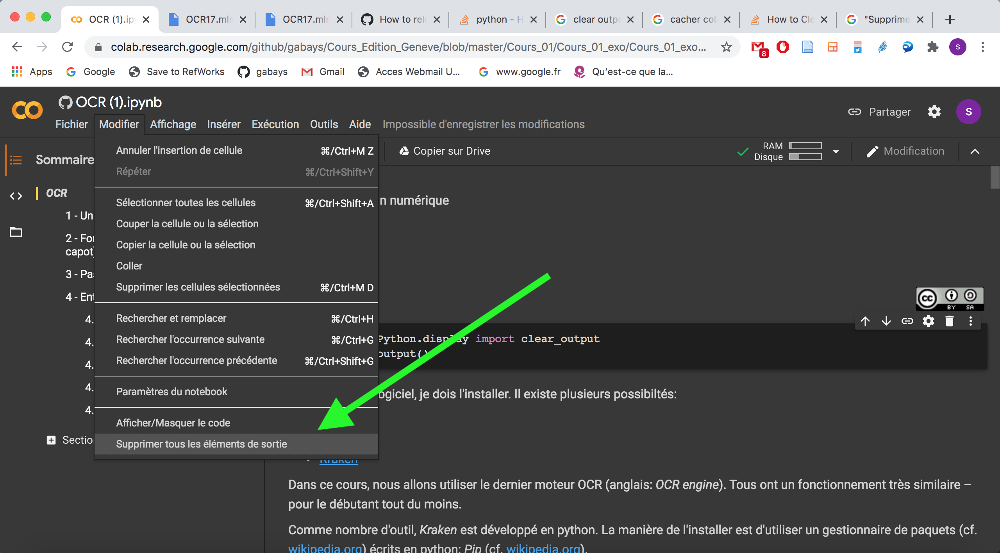

Stylistique numérique

# Lemmatisation

Simon Gabay

---
## Colab

Nous avons préparé le cours avec un _notebook_ qui est prévu pour fonctionner avec le service en ligne _Colab_ de Google.

1. Allez à l'adresse suivante: https://colab.research.google.com . (si possible en utilisant le navigateur _Chrome_).

2. Sélectionnez l'onglet `GitHub`

3. Copiez le lien suivant: `https://github.com/gabays/32M7131/blob/master/Cours_03/Cours03.ipynb`

4. Supprimez tous les éléments de sortie

