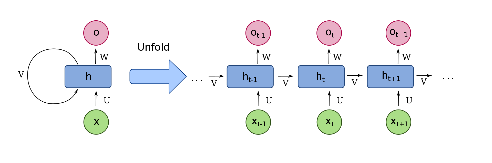
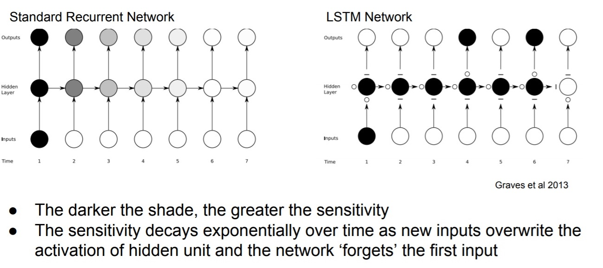
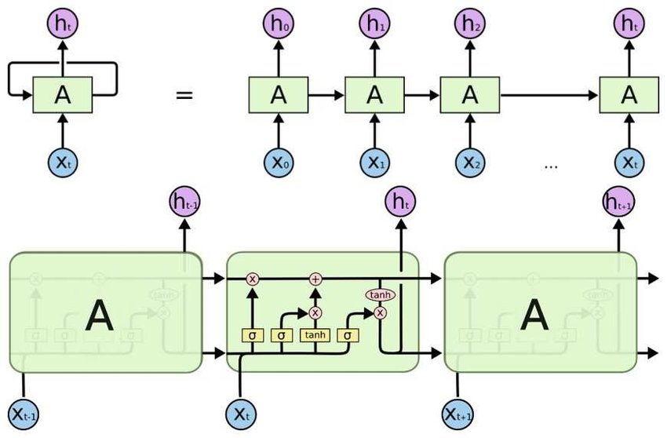
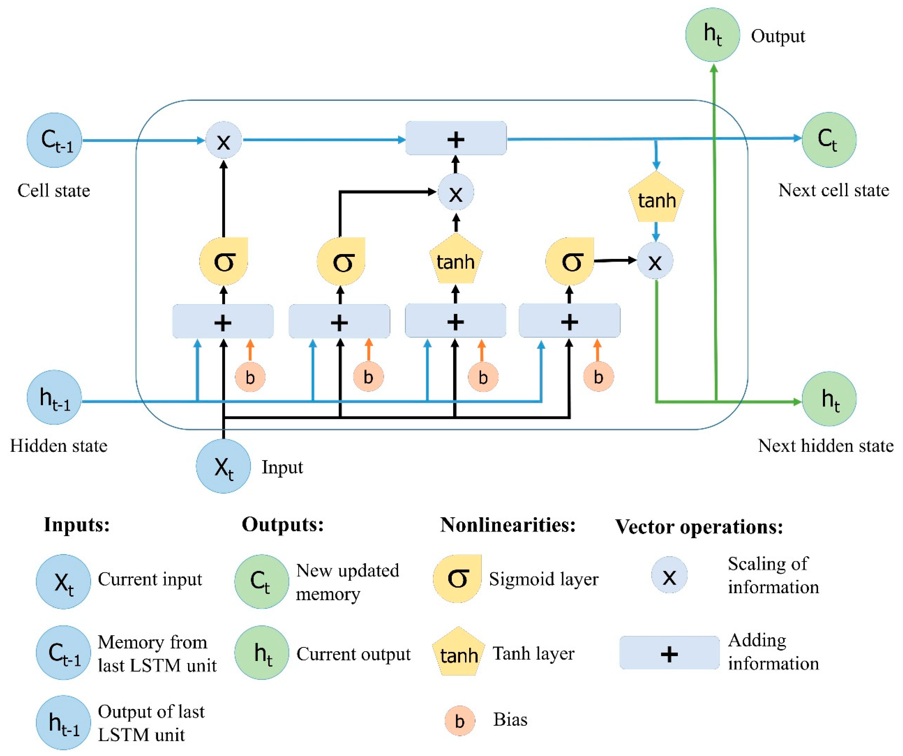
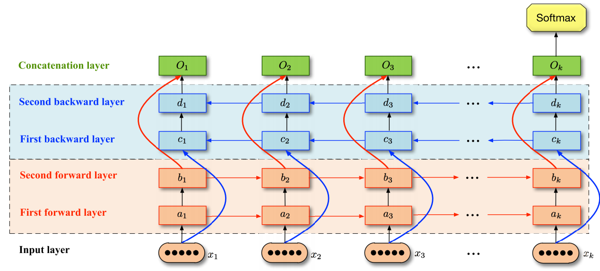
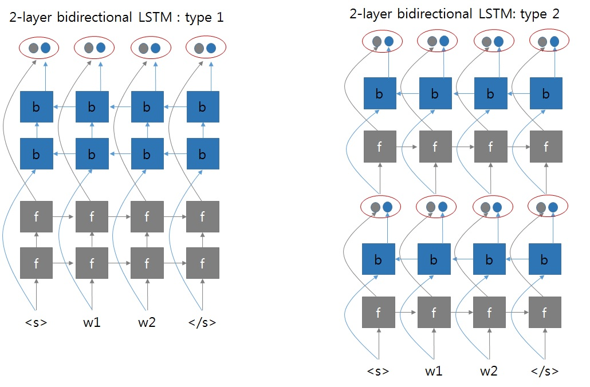
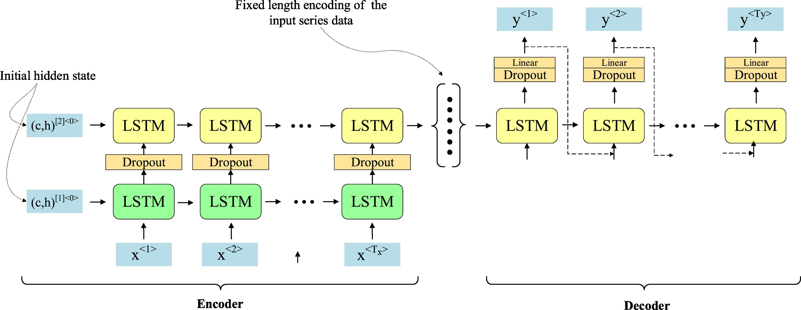

<style>
img[alt~="center"] {
  display: block;
  margin: 0 auto;
}
h1 {
  font-size: 46px;
  color: darkred;
}
h2 {
  font-size: 38px;
  color: darkred;
}
</style>

Distant Reading 2: linguistique computationnelle

# Entre normalisation et traduction

Simon Gabay

<a rel="license" href="http://creativecommons.org/licenses/by/4.0/"></a>

---
# Français non-standard

---
## Un problème de philologie

1. Transcription diplomatique, qui reste au plus proche de l'original;
2. Transcription semi-diplomatique, qui intervient à la marge sur le vêtement graphique et la ponctuation pour simplifier la lecture (éléments éléments purements graphiques) sans perdre l'essentiel de l'original (dissimilation _u_/_v_ comme dans _vniuers_->_univers_);
3. Transcription interprétative, qui intervient lourdement sur le texte pour simplifier la compréhension (intervention sur les morphèmes verbaux _estoit_->_était_);

La transcription ne peut jamais être parfaite: c'est un puits sans fond, notamment avec l'apparition de l'OCR.

---
<style scoped>
table {
    height: 100%;
    width: 100%;
    font-size: 20px;
}
</style>

## Différents types de normalisation

| Source                                 | Cible I                                | Cible II                               |
|----------------------------------------|----------------------------------------|----------------------------------------|
| rencontre de deux Monarques, les       | rencontre de deux Monarques, les       | rencontre de deux Monarques, les       |
| plus glorieux qui fuſſent alors en     | plus glorieux qui fussent alors en     | plus glorieux qui fussent alors en     |
| tout l'Vniuers, le Ciel ennemy de      | tout l'Univers, le Ciel ennemy de      | tout l'Univers, le Ciel ennemi de      |
| l'oiſiueté, & du vice, ietta les fon-  | l'oisiveté, & du vice, jetta les fon-  | l'oisiveté, et du vice, jetta les fon- |
| demens du theatre, ſur lequel ont      | demens du theatre, sur lequel ont      | dements du théâtre, sur lequel ont     |
| depuis paru les plus belles, & les     | depuis paru les plus belles, & les     | depuis paru les plus belles, et les    |
| plus illuſtres actions, qui ayent ra-  | plus illustres actions, qui ayent ra-  | plus illustres actions, qui aient ra-  |
| uy le monde en admiration: &           | vy le monde en admiration: &           | vi le monde en admiration: et          |
| dont l'eſclat venant à eſbloüir les    | dont l'esclat venant à esbloüir les    | dont l'éclat venant à éblouir les      |
| yeux de la poſterité a enflamé nos     | yeux de la posterité a enflamé nos     | yeux de la posterité a enflammé nos    |

---
## Un problème de TAL

La tâche de normalisation est assez similaire à celle de

1. La traduction d'une langue à l'autre

|      |      |    |     |            |      |      |
|------|------|----|-----|------------|------|------|
| I    | go   | to | the | restaurant | with | John |
| Je   | vais | au |     | restaurant | avec | John |

2. Le traitement des textes dans une longue non standard (type SMS)

|      |        |          |      |       |       |      |
|------|--------|----------|------|-------|-------|------|
| G    | repris | vendredi | ms   | wè    | c     | cool |
| J'ai | repris | vendredi | mais | ouais | c'est | cool |

---
# Quelques bases

---
## Corpus parallèle

On utilise un corpus parallèle pour entraîner le modèle.

| Source                                 | Cible                                  | 
|----------------------------------------|----------------------------------------|
| rencontre de deux Monarques, les       | rencontre de deux Monarques, les       |
| plus glorieux qui fuſſent alors en     | plus glorieux qui fussent alors en     | 
| tout l'Vniuers, le Ciel ennemy de      | tout l'Univers, le Ciel ennemi de      |
| l'oiſiueté, & du vice, ietta les fon-  | l'oisiveté, et du vice, jetta les fon- |

---
## Niveau de traduction

Traiter un document au niveau du mot pose problème, même si c'est _a priori_ évident.
* Ils ne recouvrent pas nécessairement le même concept
* un mot peut être en deux tokens éloignés l'un de l'autre (_Bill **cleaned** the mess **up**._). Si _nettoyer_->_clean up_ n'est pas trop compliqué, l'inverse est moins vrai.

---
## S'en sortir "par le haut"

Pour régler le problème du mot, il est possible d'élargir la fenêtre au-delà de celui-ci en adpotant des techniques:

* _phrase-based_: le niveau de la phrase permet d'éviter le problème _one to one_ posé par les tokens en traitant la séquence complète.
* _syntax-based_: plus qu'une phrase, il s'agit de détecter automatiquent des groupes syntactiques/unités phraséologiques et de les traiter comme un bloc.

---
## S'en sortir "par le bas"

On peut aussi tenter l'opération inverse, et rétraicir la fenêtre de traitement

* _subword-based_: on va utiliser des sous-mots (_BPE_ pour _Byte pair encoding_) détectés automatiquement. On peut ainsi dégager des morphèmes récurrents (_aient_ ou _ement_) qui reviennent dans des mots différents mais doivent être traités de la même manière. Ainsi:

```
aaabdaaabac
```
Si `Z=aa` (`aa` étant ici un byte), alors je peux écrire:

```
ZabdZabac
```

* _character-based_: c'est le niveau le plus précis, mais il nécessite énormément de données. Il est très développé avec la traduction automatique neuronale

---
<style scoped>
table {
    height: 100%;
    width: 100%;
    font-size: 27px;
}
</style>
## Granularité

| Granularité | Etat   | Exemple                                               |
|-------------|--------|-------------------------------------------------------|
| Phrase      | Source | Cherchons avec empreſſement                           |
|             | Cible  | Cherchons avec empressement                           |
| Mot         | Source | Cherchons avec empreſſement                           |
|             | Cible  | Cherchons avec empressement                           |
| BPE         | Source | Ch@@ er@@ ch@@ ons avec em@@ preſ@@ ſement            |
|             | Cible  | Ch@@ er@@ ch@@ ons avec em@@ pr@@ ess@@ ement         |
| Caractères  | Source | C h e r c h o n s • a v e c • e m p r e ſ ſ e m e n t |
|             | Cible  | C h e r c h o n s • a v e c • e m p r e s s e m e n t |


---
## Evaluation

L'évaluation de la traduction est un problème assez complexe. Etant donné cette traduction:

>Le chat est sur le matelat

Et le résultat de la machine:
>P1 Il y a un chat sur le matelat

Le résultat peut être considéré comme mauvais alors que c'est faux

À l'inverse, si le modèle propose:

>P2 chat chat chat chat chat chat 

Cette prédiction peut être considéré comme bon (tous les mots de P2 sont dans la vérité terrain)
___

## Les métriques


* BLEU, _Bilingual evaluation understudy_
* METEOR, _Metric for Evaluation of Translation with Explicit ORdering_
* ROUGE, _Recall-Oriented Understudy for Gisting Evaluation_
* Character F-score
* wAcc, _word accuracy_

---
# Les réseaux LSTM
---
## RNN



---
## _Short term memory_

Les séquences trop longues posent problème. Exemple:

> C'était super ce film: je suis allé le voir avec Micheline. Voilà mon avis.

Pour savoir si le compte-rendu est positif, je n'ai pas besoin de toute l'information, mais seulement d'une partie.

> **C'était super ce film**: je suis allé le voir avec Micheline. **Voilà mon avis**.

L'importance de l'information est différente de l'ordre dans lequel la séquence est traitée, et ce qui est au début se "dilue" si on accumule tout. Il faut faire le tri!

---
## La disparition du gradient



---
## LSTM

Un système de _gates_ qui permettent de déterminer quelle information est importante, ce qui est crucial pour les séquences (très) longues



Note: Les _GRU_ ont un fonctionnement similaire aux _LSTM_.

---
## Celulle LSTM (dite "à mémoire interne")



---
## Bi-LSTM

On séquence l'information dans les deux directions



---
## Bi-LSTM: deux méthodes



---
## Multicouches

Il est possible d'encoder les couches de neurones



