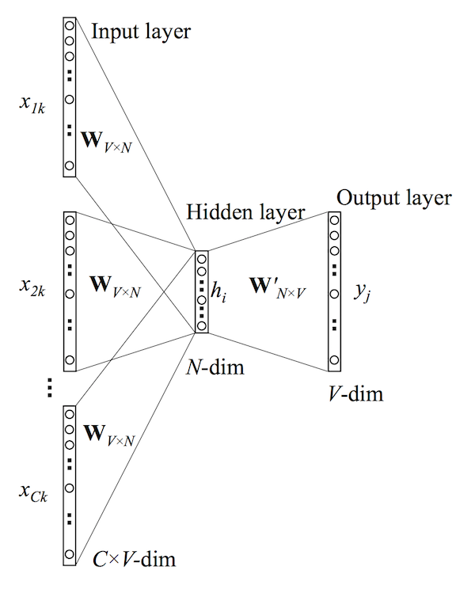
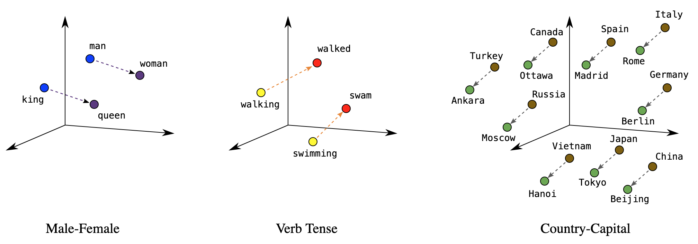

Distant Reading 2: linguistique computationnelle

# Les plongements de mots

Simon Gabay

---
# Le modèle de langue

---
## Défintion

> Un modèle de langue est une distribution de probabilités sur les séquences de mots

Il a deux utilités:
- trouver le mot suivant le plus probable d'après les mots qui le précèdent
- trouver le mot masqué selon les mots qui le précède (et lui succède)

--- 
## Le modèle statistique

Il s'agit de **compter**

Le système le plus simple est celui du "modèle unigramme" Ainsi la probabilité _P_ de trois mots _w_ est la suivante:

P₁(w₁w₂w₃) = P(w₁)P(w₂)P(w₃)

-> quelle est la fréquence d'un mot?

Il existe des modèles plus complexes dits "bigrammes" ou "n-grams":

P₂(w₁w₂w₃) = P(w₁|#)P(w₂|w₁)P(w₃|w₂)

-> quelle est la probabilité que ce soit un mot w₁, étant donné le mot qui le précède w₂?

--- 
## Le modèle prédictif

Il s'agit de **prédire**

Etant donnée une position et un contexte, est-il possible de prédire quel est le mot qui suit? (cf. les recherches sur google).

Il existe deux types de contexte:
- le contexte gauche
- le contexte droit et gauche (dit "complet")

Ce sont ces modèles qui nous intéressent.

---
# Des chiffres et des lettres

---
## Représenter un mot

Un mot est une somme d'information: il est composé de lettres, de morphèmes, d'un rôle syntaxique, de sèmes…
* un mot avec la lettre _w_ en français dit quelque chose de l'origine de ce mot (origine germanique)
* un finale en _-ai-_ dit autre chose de ce mot (imparfait ou conditionnel)
* la racine _chat_ de _chatte_ dit quelque chose du champ lexical (au sens fort de léxème) de ce mot
* _il aime son chat_ dit quelque chose sur la nature du référent (animé…)

Il est possible de présenter cette information sous forme linguistique, comme nous venons de le faire, mais on peut aussi le faire sous la forme d'un vecteur (en gros un nombre plus ou moins long)

---

## Le vecteur dit _one-hot_

Prenons deux phrases: _Il aime Jeannette_ et _Elle aime Raoul_.

La représentation vectorielle la plus simple consiste à se doter d'un vocabulaire de taille _n_ et à utiliser pour représenter le _i_-ième mot du vocabulaire un vecteur où toutes les dimensions sont nulles sauf la _i_-ième qui vaut 1.

|           | il | aime | Jeannette | elle | Raoul |
|-----------|----|------|-----------|------|-------|
| il        | 1  | 0    | 0         | 0    | 0     |
| aime      | 0  | 1    | 0         | 0    | 0     |
| Jeannette | 0  | 0    | 1         | 0    | 0     |

* il -> `[1 0 0 0 0]`
* aime -> `[0 1 0 0 0]`

Note: il est compliqué d'ajouter un nouveau mot (si l'on devait agrandir le corpus par exemple).

---

## _index-based encoding_

Il est possible de simplifier ce système (et réduire la taille de la matrice) avec un _index-based encoding_, qui assigne comme valeur à chaque mot sa position dans le lexique

| Lexique   | Clef |
|-----------|------|
| il        | 1    |
| aime      | 2    |
| Jeannette | 3    |
| elle      | 4    |
| Raoul     | 5    |

* Il aime Jeannette -> `[1 2 3]`
* Elle aime Raoul -> `[4 2 5]`

---
## Hypothèse distributionnelle

Le problème avec les valeurs de l'index ou des vecteurs _one hot_, c'est
* qu'elles sont arbitraires: _il_ (`1`) et _elle_ (`4`) ont des valeurs moins proches qu'_il_ (`1`) et _Jeannette_ (`3`). C'est un problème.
* qu'elles sont toujours distantes de 1, alors que _il_ et _elle_ sont plus proches que _Raoul_ et _aimer_

On parle d'"hypothèse distributionnelle" : deux mots sont similaires s’ils apparaissent dans les mêmes contextes. Ainsi "médecin" et "docteur" apparaissent dans des contextes similaires.

> You shall know a word by the company it keeps! (Firth 1957)

> If A and B have almost identical environments we say that they are synonyms. (Harris 1954) 

---

# Le plongement de mots

---

## _Embeddings_ (ou "plongement") non contextuel

Avec de la sémantique distributionnelle, il est possible d'évaluer la proximité des mots à partir des fréquences de collocation, et donc de proposer des vecteurs moins grands que les _one hot_ (il -> `[1 0 0 0 0]`) et donc des valeurs moins arbitraires. Les _word embeddings_ (ou "plongements lexicaux") reprennent et améliorent la "représentativité vectorielle".

| Lexique   | Clef |
|-----------|------|
| il        | 0.12 |
| aime      | 0.23 |
| Jeannette | 0.76 |
| elle      | 0.13 |
| Raoul     | 0.66 |

---
## Word2vec

Word2vec n'est qu'une _lookup table_.

([Source](https://www.hackdeploy.com/word2vec-explained-easily/))

Ou `V` et la taille du vocabulaire et `E` le nombre de dimensions.

---
## Qu'est-ce que cette couche cachée?

Nous allons tenter de:
* trouver un mot en fonction de son contexte (CBOW)
* trouver un contexte en fonction d'un mot (skip-gram)

---

## Entrainement

Ici une architecture CBOW prenant un mot sur deux du contexte complet:

[Source](https://datascientest.com/nlp-word-embedding-word2vec)

---
## Réseau de neurone pour `word2vec`

Il s'agit d'un perceptron à une couche cachée (ici modèle CBOW):

La manière la plus simple de commencer est une initialisation aléatoire des poids dans le réseau de neurone qui permet, étant donné les vecteurs pris en _input_, de prédire le mot en _output_ via une fonction mathématique complexe.

---
## Réseau de neurone: détail de fonctionnement

Il s'agit d'un perceptron à une couche cachée

---
## La similarité

Lorsque le plongement de mots est bien fait, on observe des régularités

Ces régularités permettent donc de contrôler la qualité du modèle produit.

---
## Limite

Si l'entraînement utilise le contexte, l'encodage _one hot_ n'en tient pas compte! Ainsi la phrase:

> Cet avocat pourri est mangé par un avocat pourri.

Doit-on la prendre au sens métaphorique ou littéral? _avocat_ au sens de "juriste" ou d'"aliment", et _pourri_ au sens de "décomposé" ou "malveillant" sont-ils les mêmes mots? Leur encodage _one hot_ est pourtant le même:

|           | cet | avocat | pourri | est | mangé | par | un  |
|-----------|-----|--------|--------|-----|-------|-----|-----|
| avocat    | 0  | 1       | 0      | 0   | 0     | 0   | 0   |
| pourri    | 0  | 0       | 1      | 0   | 0     | 0   | 0   |

---
## Rafinements

---

# Rafinements

Des améliorations ont été apportées au modèle _word2vec_ qui
* ne peut traiter que des mots qui sont dans sont lexique et pas des mots "nouveaux" -> _FastText_
* ne tient pas compte d'un contexte plus large que quelques tokens et pas du corpus -> _GloVe_

---
## FastText

Que se passe-t-il si un mot n'est pas dans cette matrice? Intuition: en le décomposant (_chantait_ c'est le radicale "chant" et le morphème de l'imparfait "ai" suivi du morphème de P3 "-t") on peut gérer des mots absents du corpus d'entraînement (et améliorer les _embeddings_).

Contrairement à _GloVe_ qui prend une échelle macro, celle du corpus, _FastText_ prend un approche micro, au niveau du n-gramme (on parle de sous-mot).

_FastText_ ne va pas utiliser des mots, mais des sous-mots:

> avocat
> `<av` `avo` `voc` `oca` `cat` `at>`

Attention au temps de traitement!

---
## Réseau de neurone pour FastText

Il reprend la même architecture que _word2vec_:

La différence est qu'en _input_ et _output_ on a des n-grammes.

---

## Glove

_Glove_ va pondérer la prédiction avec les statistiques de fréquence à l'échelle du corpus. Il construit une matrice de co-occurence (le nombre de mots par le nombre de contextes possibles):

>La fondue est neuchâteloise
>La fondue est au fromage

|                | La | fondue | est | neuchâteloise | au | fromage |
|----------------|----|--------|-----|---------------|----|---------|
| La             | 0  | 2      | 2   | 1             | 1  | 1       |
| fondue         |    | 0      | 2   | 1             | 1  | 1       |
| est            |    |        | 0   | 1             | 1  | 1       |
| neuchâteloise  |    |        |     | 0             | 0  | 0       |
| au             |    |        |     |               | 0  | 0       |
| fromage        |    |        |     |               |    | 0       |

---
## Approche par séquence

Les réseaux de neurones se complexifient. Pour les modèles que nous nous apprêtons à présenter, on s'appuie désormais sur des réseau de neurones récurrents (RNN) pour analyser des séquences.

On tient compte du mot précédent de manière dynamique: plutôt qu'un contexte délimité par une fenêtre, on travaille donc de séquence à séquence (_sequence to sequence_).

Nous y reviendrons dans un autre cours!

---

Ce cours s'inspire fortement de celui de B. Sagot donné à Genève en décembre 2022 dans le cadre d'un atelier PDEN