

Distant Reading 2: linguistique computationnelle

# Les classifieurs

Simon Gabay

---

## Notion préalables

On parle de classification des données, ou _data classification_.

L'idée est de pouvoir classer/catégoriser des données selon des classes/catégories prédéfinies à l'avance.

---
## Exemples

Cette phrase est-elle en français?
> Hello, my name is Simon!

Ce texte est-il en vers?
>Demain, dès l’aube, à l’heure où blanchit la campagne,
>Je partirai. Vois-tu, je sais que tu m’attends.

Ce mot est-il un substantif?
>Classifieur

etc.

---
## Type de classifications

Il existe deux grands types de classifieurs:

- binaires: oui/non, positif/négatif, blanc/noir
- multiclasses: POS, sentiments

---
## Méthodes

Il existe de nombreux algorithmes de classification, qui sont appartiennent à la catégorie de l'apprentissage supervisé

- Forêt d'arbres décisionnels
- Machine à vecteurs de support
- Méthode des k plus proches voisins
- Classification naïve bayésienne

Il existe aussi des méthodes de _boosting_:
- Adaptative boosting
- Gradient Boosting

---
# Algorithmes

---
## Arbres décisionnels

L'arbre de décision est un modèle prédictif. 

Visuellement, on peut le représenter sous la forme d'une structure arborescente descendante composée de noeuds, qui sont une condition appelant plusieurs réponses possibles jusqu'au nœud terminal.

Un bon exemple pourrait être celui d'un arbre permettant de décider si l'on doit prendre un parapluie.

---
Dois-je prendre un parapluie?

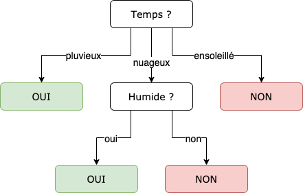

---
## Forêt d'arbres décisionnels

La forêt d'arbres décisionnels, en anglais _random forest classifier_ ([Ho 1995](https://ieeexplore.ieee.org/document/598994)) est une améioration de l'arbre décisionnel.

C'est une méthode d'apprentissage ensembliste: on utilise plusieurs algorithmes d'apprentissage pour obtenir de meilleures prédictions. C'est pour cela qu'on utilise le terme de _forêt_ d'arbres décisionnels.

Concrètement, on effectue un apprentissage sur de multiples arbres de décision entraînés sur différents échantillons de données. La prédiction correspond au résultat du vote entre les différents arbres.

---
## Hyperparamètres

Nous allons devoir définir notamment:
- La forme de l'arbre (le nombre de nœuds qu'il peut contenir). On parle de profondeur (_depth_)
- Le nombre d'arbres qui vont être construits et qui voteront lors de la prédiction.

---
## Machine à vecteurs de support

On parle aussi de séparateurs à vaste marge pour conserver l'acronyme SVM (pour _support vector machine_)

- La marge est la distance entre la frontière de séparation et les échantillons les plus proches: elle doit être la plus grande possible en minisant le nombre d'erreurs. Ces échantillons sont les vecteurs de support.
- S'il est impossible de séparer linéairement les données, on va utiliser une fonction noyau pour augmenter le nombre de dimensions  et tenter de trouver dans ce nouvel espace une séparation linéaire.

Example: déterminer à partir de la longueur des pétales et des sépales le type de fleur.

---
## La (vaste) marge

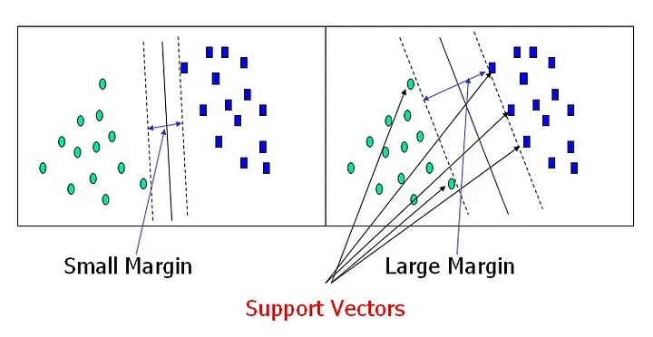

---
## N dimensions

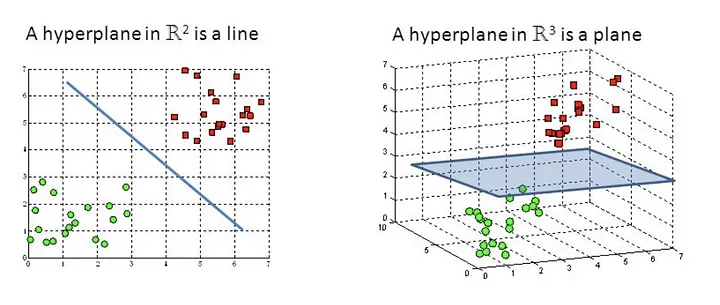

---
## Hyperparamètres

- La constante de régularisation, qui permet de contrôler la marge (ou l'erreur). La régularisation est d'autant plus forte que C (_cost_) est proche de 0.
- L'astuce du noyau: il existe différentes fonctions pour transformer un espace en un espace de plus grande dimension: RBF, sigmoïde… Il n'est pas obligatoire d'utiliser ce _kernel trick_.

---
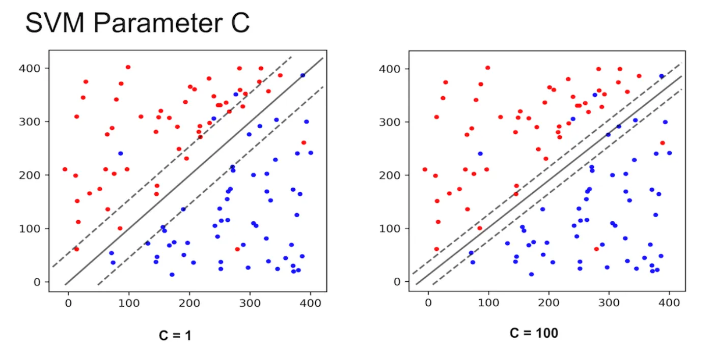

---
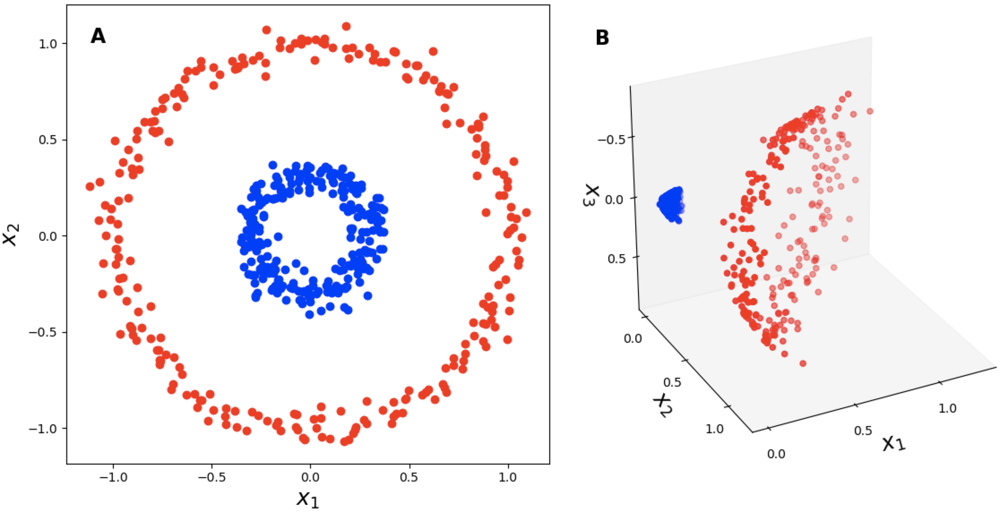

---
## Méthode des k plus proches voisins

On utilise l'acronyme KNN, pour _k-nearest neighbors_.

Le principe est le suivant: pour chaque nouvelle donnée _x_, la machine va chercher des _k_ données similaires.

---

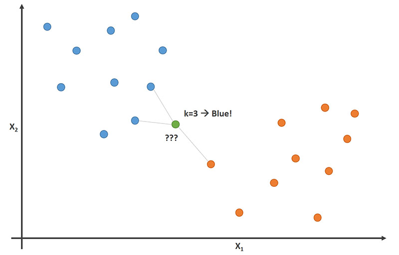

---
## Hyperparamètres

- K: le nombre de voisins pris en compte pour la classification. Un chiffre trop bas rend dépendant le résultat à des _outliers_, un chiffre trop haut va brouiller le résultat.
- Distance: comme on doit mesurer une distance entre les différents points, il existe plusieurs mesures de distance (euclidienne, manhattan…)
- Poids: on va attribuer un poids en fonction de la distance, pour que les plus proches comptent plus

---
## Le nombre de voisins

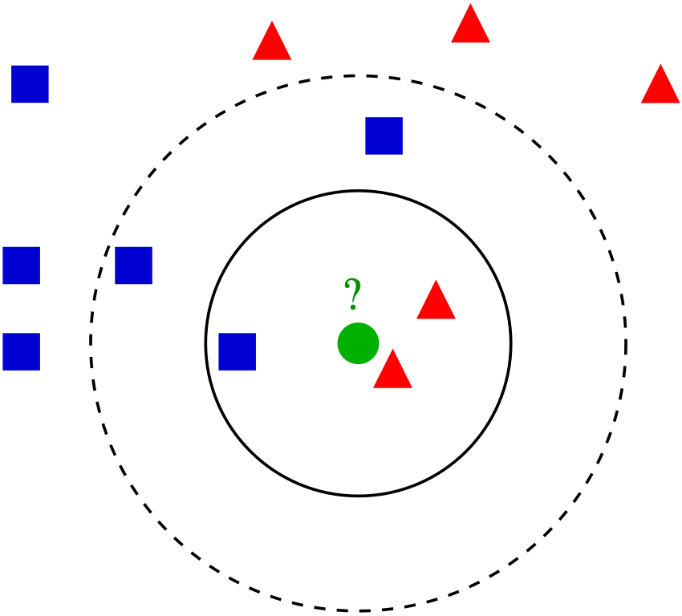

En fonction du nombre de voisins choisis, la classification du point vert varie.

---
## Les mesures de distance

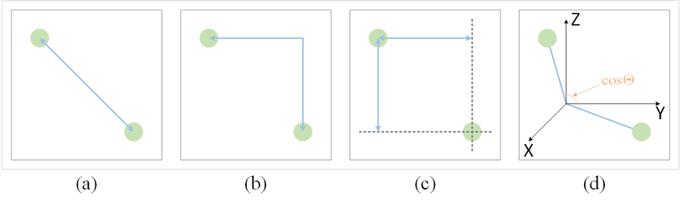

(a) euclidienne, (b) Manhattan, (c) Chebyshev, (d) cosine…

---
## Utiliser les poids

Intuition: un nouveau point sera plus probablement associé à une classe nombreuse que rare.

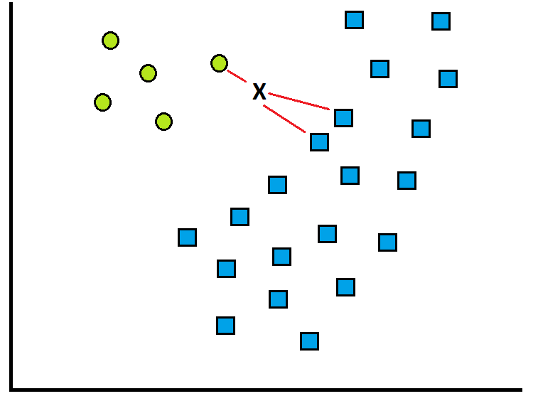

On divise le nombre de voisins (1 et 2) par le nombre d'individus dans chaque classe (5 et 20): 1/5 > 2/20=1/10

---
# _Boosting_

---
## _boosting_ ou _bagging_

- Le _bagging_ : on va échantillonner les données, et la prédiction finale correspond à la moyenne des prédictions effectuées parallèlement (système de vote);
- Le _boosting_:  on va échantillonner les données et on va claculer les prédictions consécutivement, chaque prédiction tenant compte des erreurs obtenues précédemment. La prédiction finale correspond à une moyenne _pondérée_ des différentes prédictions.

⚠️ Attention au temps de calcul!

---
## Adaptative boosting

Plutôt qu'utiliser un seul classifieur, on va utiliser _x_ classifieurs dit _faibles_ dont les prédictions sont combinées en une somme pondérée qui représente la sortie finale du classeur "boosté".

Ces classifieurs faibles sont appelés des _stumps_: ce sont des arbres de très faible profondeur (=1) qui "caricaturent" les choix mais dont le grand nombre et l'apprentissage itératif permet parfois d'obtenir de meilleurs résultats.

À cause de l'utilisation des _stumps_, AdaBoost est traditionnellement utilisé avec des forêts d'arbres décisionnels.

---
## Le _boosting_ via des _stumps_

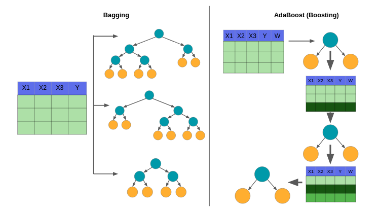

---
## La moyenne pondérée

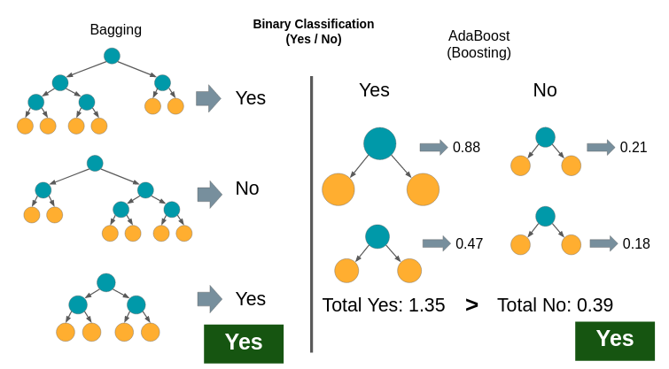

