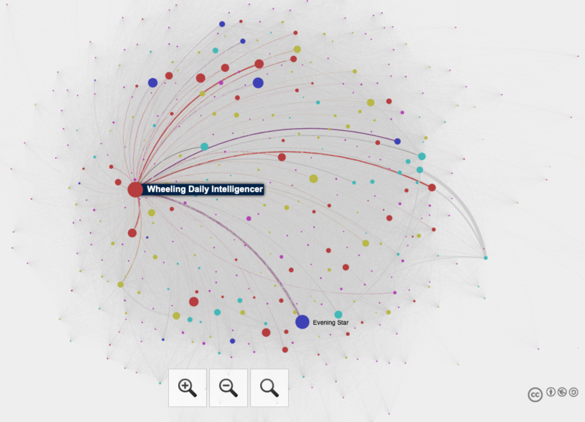
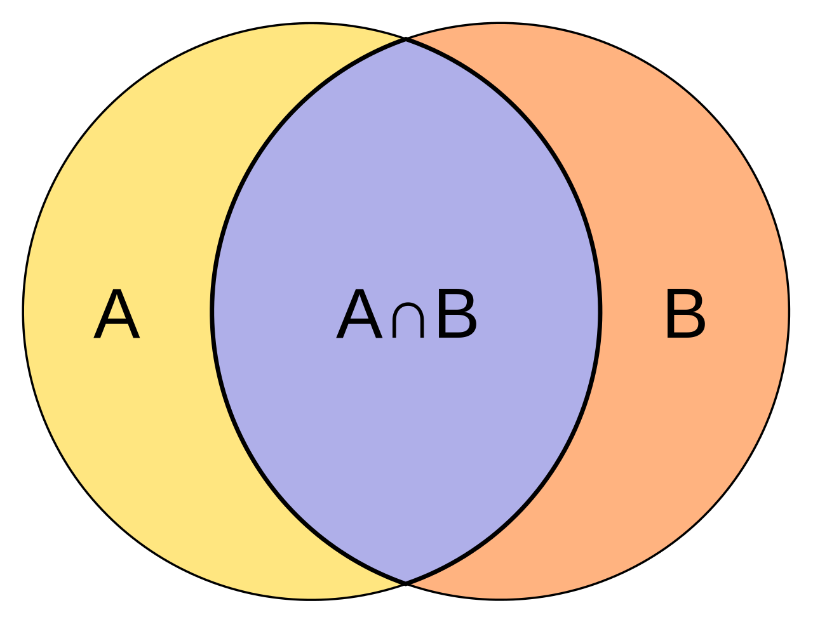
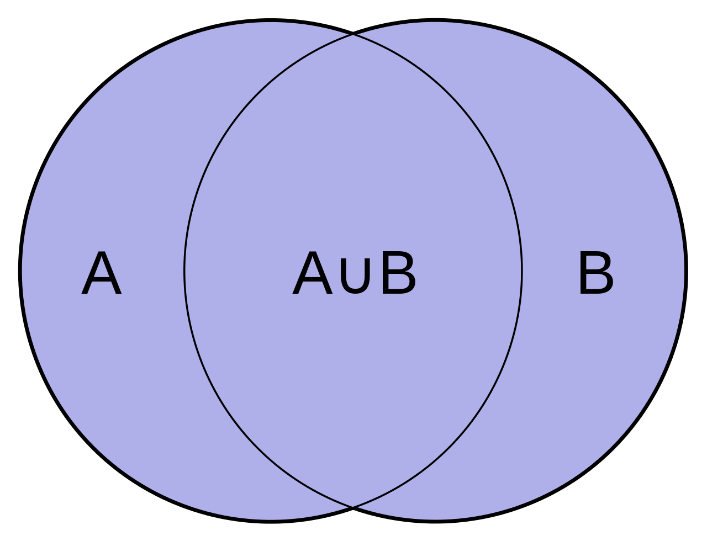
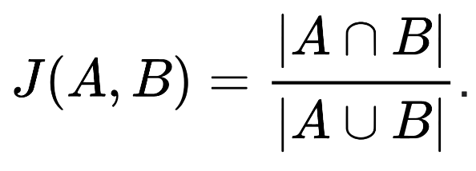
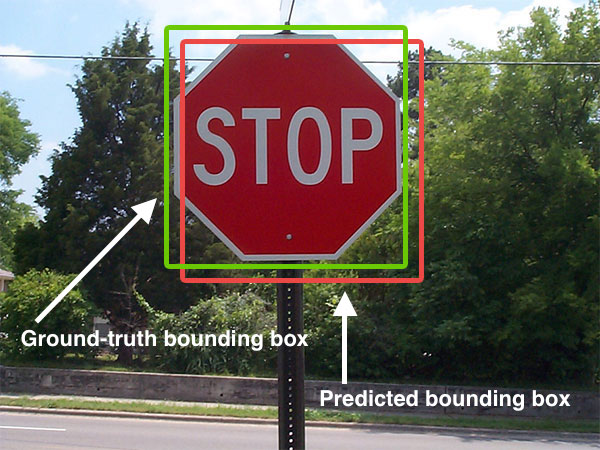
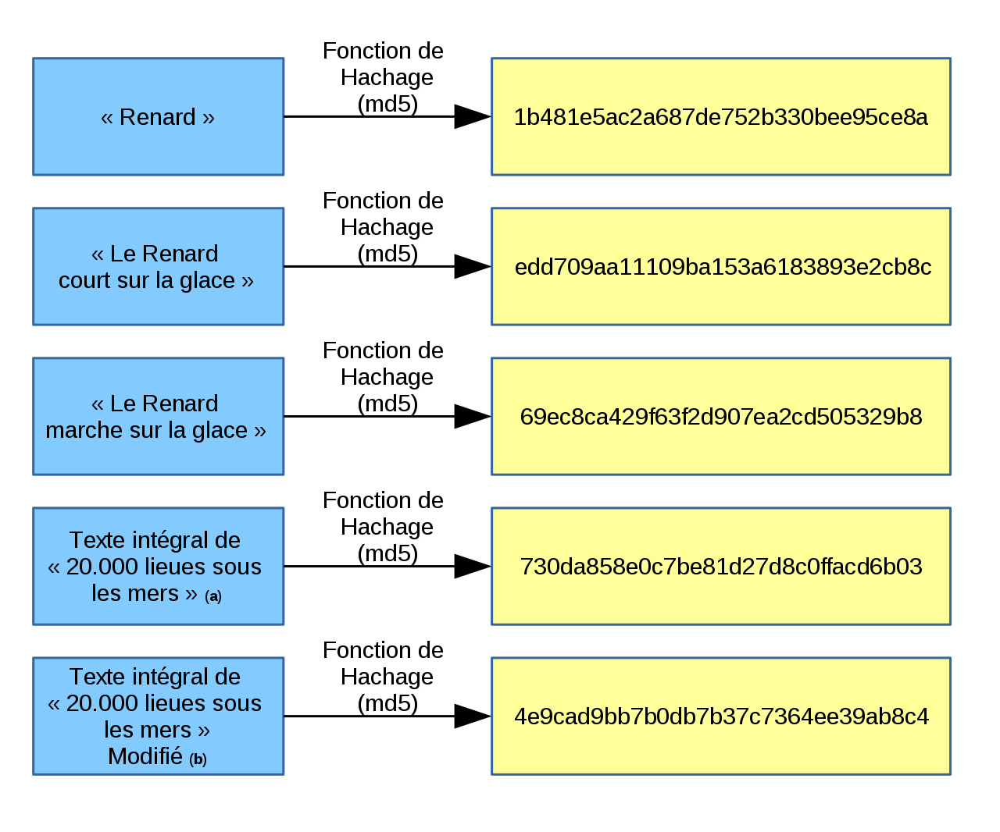

Cours Stylistique numérique

# Le réemploi

Simon Gabay

---
# Introduction

---

## Définition

On parle de _text reuse_, en français «réutilisation de texte».

La question de savoir ce qu'on «réutilise» est importante:

- Exactement les mêmes termes
- À peu près les mêmes termes
- Un peu la même idée

Matteo Romanello, Aurélien Berra et Alexandra Trachsel proposent la définition suivante: il s'agit d'une «réitération significative d’un texte, généralement au-delà de la simple répétition du langage courant» (Romanello et al. 2014)

---
## Applications

Dans le cadre pédagogique, on va surtout utiliser l'analyse de réemploi pour la détection de plagiat.

En philologie, on va surtout s'intéresser:

- Aux citations;
- Aux paraphrases;
- Aux allusions.

Evidemment, le degré de difficulté varie en fonction de la distance entre la source son réemploi.

---
## _Viral texts_

Le Projet _Viral texts_ étudie le réemploi dans la presse américaine du XIXe s. (cf. https://viraltexts.org).

Il est possible, par exemple, de voir quel journal influence quel autre, en regardant qui copie qui.

---
## Nombreuses applications

L'analye de réemploi est devenue une tâche courante du Traitement Automatique des Langues (TAL). De nombreux outils existent, programmés dans différents langages:

- `textReuse` (en R)
- `TRACER` (en Java)
- `Passim` (en scala)
- …

La difficulté de prise en main varie énormément d'un outil à un autre.

Les outils ne sont pas toujours maintenus (cf. TRACER).

---
# Problèmes

---
## Problèmes I: la variation graphique

Les spécialistes des sciences humaines savent que les langues ont connu différents états de langue

| 1  | 2      | 3 | 4    |
|----|--------|---|------|
| Tu | estois | a | Lion |
| Tu | étais  | à | Lyon |

Comment faire pour aligner un texte qui est manifestement le même, mais pas écrit strictement de la même manière?

---

## Problèmes II: Ajout/suppression

Si la chaîne de texte n'est pas deux fois strictement la même, est-ce le même texte? Le problème d'alignement se complexifie:

| 1  | 2      | ?    | 3 | 4    |
|----|--------|----- |---|------|
| Tu | estois | hier | a | Lion |
| Tu | estois |      | a | Lion |

À Partir de combien d'ajout ou de suppression considérons-nous qu'il s'agit d'un autre texte?

---
## Problèmes III: la reformulation

Si la chaîne de texte est (partiellement) reformulée, est-ce le même texte?

| 1  | 2      | 3    | 4                      |
|----|--------|------|------------------------|
| Tu | estois | a    | Lion                   |
| Tu | es     | a    | Lion                   |
| Tu | estois | dans | la capitale des Gaules |
| Tu | es     | dans | la capitale des Gaules |

1. Comment identifier qu'il s'agit de la même chose?
2. Est-ce vraiment la même chose?

---
# Solutions

---
## N-grams

Il est important de découper le texte en _n-grams_ (n-grammes). Un _n-gram_ est une sous-séquence de _n_ éléments construite à partir d'une séquence donnée. Ainsi la phrase:

> S'ils furent ma blessure, ils seront mon Achille, S'ils furent mon venin, le scorpion utile

Je peux faire des _n-grams_ de 3 tokens:
1. s'ils furent ma
2. furent ma blessure
3. ma blessure ils
4. …

Evidemment la taille du _n-gram_ (ici des _3-grams_ ou trigrammes) influe sur les résultats.

---
## Skip grams

Afin de ne pas manquer des réemplois légèrement différents, on peut utiliser des _skip grams_, c'est-à-dire des _n-grams_ non consécutifs

> S'ils furent ma blessure, ils seront mon Achille, S'ils furent mon venin, le scorpion utile

Avec un _skip_ de 2:
1. s'ils blessure mon
2. furent ils achille
3. ma seront s'ils
4. …

Evidemment la taille du _skip gram_ influe aussi sur les résultats.

---
## Distance de Jaccard

Une fois obtenue les _n-grams_ il faut les comparer. Pour cela on utilise (par exemple) la distance de Jaccard (« coefficient de communauté »).

Cette distance est utilisée pour évaluer la similarité entre deux échantillons. Elle mesure le rapport entre:

- le cardinal (la taille) de l'intersection (la présence de tokens identiques dans les deux échantillons) des ensembles (les deux échantillons comparés)
- le cardinal (la taille) de l'union (la somme des tokens) des ensembles (les deux échantillons comparés)

---
## Distance de Jaccard

1. le cardinal de l'intersection des ensembles (source: [Wikipedia](https://commons.wikimedia.org/wiki/File:Intersection_of_sets_A_and_B.svg))

2. le cardinal de l'union des ensembles (source: [Wikipedia](https://commons.wikimedia.org/wiki/File:Union_of_sets_A_and_B.svg))

---
## _Intersection over union_

L'index de Jaccard (_J_) est noté:

On entend parfois la formule _intersection over union_ (IoU). C'est une méthode très utilisée en vision par ordinateur (_computer vision_).

Source: [Wikipedia](https://commons.wikimedia.org/wiki/File:Intersection_over_Union_-_object_detection_bounding_boxes.jpg)

---
## Minhash

Le problème de cette technique est qu'elle est particulièrement chronophage: il faut comparer tous les tokens/n-grammes. On peut aller plus vite avec _MinHash_.

1. On utilise une _hash function_ qui, à partir d'une donnée fournie en entrée,  transforme le texte en une série de clefs numériques.
2. Ce sont ces empreintes numériques (ou _hash_), optimisées pour l'analyse computationnelle, que nous allons comparer

Le taille de ce que l'on veut hacher va du plus simple (un mot) au plus compliqué (une œuvre). Ce hachage peut être réversible ou non (cf. cryptographie)

---
## Exemple de "hachage"

Source: [Wikipedia](https://commons.wikimedia.org/wiki/File:Hachage.svg)

---
## _Locality sensitive hashing_

Le hachage n'est cependant pas optimum si les empreintes ne reflètent pas les proximités. Pour corriger ce défaut, on utilise le _Locality sensitive hashing_ (LSH).

Le LSH utilise un algorithme de "recherche des plus proches voisins". On peut ainsi évacuer de la somme des comparaisons à faire toutes les paires dont l'empreinte est divergeante, et gagner du temps, ce qui est utile pour les gros corpus.